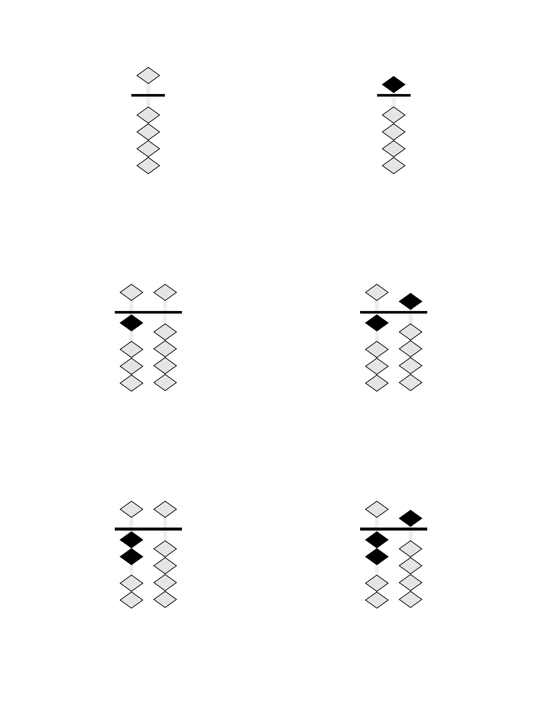

# Soroban Flashcard Generator

A vector-based PDF flashcard generator for learning soroban (Japanese abacus) numbers. Creates double-sided flashcards with soroban bead representations on the front and Arabic numerals on the back.

## Examples

<table>
<tr>
<td align="center">
<br>
<b>Soroban (Front)</b>
</td>
<td align="center">
<br>
<b>Numeral (Back)</b>
</td>
<td align="center">
<br>
<b>Place-Value Colors</b>
</td>
<td align="center">
<br>
<b>Colored Numerals</b>
</td>
</tr>
</table>

### Bead Shapes

<table>
<tr>
<td align="center">
<br>
<b>Diamond (Realistic)</b>
</td>
<td align="center">
<br>
<b>Circle (Traditional)</b>
</td>
<td align="center">
<br>
<b>Square</b>
</td>
</tr>
</table>

### Layouts and Options

<table>
<tr>
<td align="center">
<br>
<b>6 Cards Per Page</b>
</td>
<td align="center">
<br>
<b>12 Cards Per Page</b>
</td>
</tr>
<tr>
<td align="center">
<br>
<b>Skip Counting by 5s</b>
</td>
<td align="center">
<br>
<b>Hidden Inactive Beads</b>
</td>
</tr>
</table>

## Features

- 🎯 **Pure vector graphics** - All soroban diagrams and text are rendered as vectors
- 📏 **Configurable layouts** - 1 to 30+ cards per page with automatic scaling
- 🖨️ **Duplex printing ready** - Automatic front/back alignment for double-sided printing
- 🔤 **Embedded fonts** - Bundled DejaVu Sans for consistent output
- 🔢 **Flexible number ranges** - Generate cards for any range or custom list
- 🎨 **Color schemes** - Educational colors for place-value, heaven-earth, alternating
- 🌈 **Colored numerals** - Match numeral colors to bead colors
- ✂️ **Cutting guides** - Full-page guides for accurate card separation
- 🔷 **Customizable beads** - Diamond (realistic), circle, or square shapes
- 📈 **Skip counting** - Count by 2s, 5s, 10s, or any increment
- 🔀 **Hide inactive beads** - Cleaner display for beginners
- 📦 **Node.js/TypeScript integration** - Clean function interface for web apps

## Quick Start

### Prerequisites

- macOS (tested on latest versions)
- Python 3 (included with macOS)
- Typst (PDF generation engine)
- qpdf (optional, for linearization)

### Installation

```bash
# Install dependencies
make install

# Or manually:
brew install typst qpdf
pip3 install pyyaml
```

### Generate Flashcards

```bash
# Generate default set (0-9)
make

# Generate from config file
python3 src/generate.py --config config/0-99.yaml

# Custom range
python3 src/generate.py --range 0-99

# Custom list of numbers
python3 src/generate.py --range "1,2,5,10,20,50,100"

# With shuffle
python3 src/generate.py --range 0-99 --shuffle --seed 42
```

## Configuration

### Using Configuration Files

Create a YAML or JSON file with your preferences:

```yaml
range: "0-99"
cards_per_page: 6
paper_size: "us-letter"
orientation: "portrait"
margins:
  top: "0.5in"
  bottom: "0.5in"
  left: "0.5in"
  right: "0.5in"
gutter: "5mm"
show_cut_marks: true
show_registration: true
font_family: "DejaVu Sans"
font_size: "48pt"
columns: auto
show_empty_columns: false
shuffle: false
seed: 42  # For deterministic shuffling
```

### Command-Line Options

```bash
python3 src/generate.py [OPTIONS]

Options:
  --config, -c FILE           Configuration file (JSON or YAML)
  --range, -r RANGE          Number range (e.g., "0-99") or list (e.g., "1,2,5")
  --step, -s N               Step/increment for ranges (e.g., 2 for even numbers)
  --cards-per-page N         Cards per page (default: 6, supports 1-30+)
  --paper-size SIZE          Paper size (default: us-letter)
  --orientation ORIENT       Page orientation (portrait/landscape)
  --margins T,R,B,L          Margins (e.g., "0.5in,0.5in,0.5in,0.5in")
  --gutter SIZE              Space between cards (default: 5mm)
  --shuffle                  Shuffle the numbers
  --seed N                   Random seed for deterministic shuffle
  --cut-marks                Show cut marks
  --registration             Show registration marks for alignment
  --font-family FONT         Font family (default: DejaVu Sans)
  --font-size SIZE           Font size (default: 48pt, auto-scales)
  --columns N                Soroban columns (auto or number)
  --show-empty-columns       Show leading empty columns
  --hide-inactive-beads      Hide inactive beads (show only active)
  --bead-shape SHAPE         Bead shape (diamond/circle/square)
  --color-scheme SCHEME      Color scheme (monochrome/place-value/heaven-earth/alternating)
  --colored-numerals         Color numerals to match bead colors
  --scale-factor N           Manual scale adjustment (0.1-1.0, default: 0.9)
  --output, -o FILE          Output PDF path (default: out/flashcards.pdf)
  --linearize                Create linearized PDF (default: true)
```

## Soroban Representation

The soroban is rendered with:
- **1 heaven bead** (worth 5) per column
- **4 earth beads** (worth 1 each) per column
- **Active beads** shown in black, moved toward the reckoning bar
- **Inactive beads** shown in light gray, away from the bar
- **Columns** represent place values (ones, tens, hundreds, etc.)

### Column Display Options

- `columns: auto` - Shows minimal columns needed
- `columns: 3` - Always shows 3 columns (e.g., for 0-999)
- `show_empty_columns: true` - Shows leading zeros
- `show_empty_columns: false` - Suppresses leading zeros

## Print Settings

### For Best Results

1. **Paper**: US Letter (8.5" × 11") or A4
2. **Margins**: Default 0.5" works with most printers
3. **Duplex**: Long-edge binding, automatic duplex
4. **Cut marks**: Enable with `--cut-marks` for easier cutting
5. **Registration**: Enable with `--registration` for alignment verification

### Duplex Printing

The PDFs are specifically formatted for double-sided printing:
- **Odd pages (1, 3, 5...)**: Soroban bead diagrams (front of cards)
- **Even pages (2, 4, 6...)**: Arabic numerals (back of cards)
- Pages are properly ordered for **long-edge binding** (standard duplex)
- Back sides are horizontally mirrored to align correctly when flipped

To print double-sided:
1. Open the PDF in your viewer
2. Select Print → Two-Sided → Long-Edge Binding
3. The printer will automatically place numerals on the back of each soroban diagram

### Sample Configurations

- `config/default.yaml` - Basic 0-9 set
- `config/0-99.yaml` - Two-digit numbers with cut marks
- `config/3-column-fixed.yaml` - Three-digit numbers, fixed width
- `config/minimal-beads.yaml` - Hide inactive beads for clarity
- `config/circle-beads.yaml` - Traditional circular beads
- `config/place-value-colors.yaml` - Place value color coding
- `config/colored-numerals.yaml` - Colored numerals matching beads
- `config/count-by-5s.yaml` - Skip counting by 5s

## Project Structure

```
soroban-abacus-flashcards/
├── src/
│   ├── generate.py         # Main CLI tool
│   ├── bridge.py          # Node.js integration bridge
│   └── api.py             # FastAPI server (optional)
├── templates/
│   └── flashcards.typ      # Typst template with soroban rendering
├── config/                 # Preset configurations
│   ├── default.yaml
│   ├── 0-99.yaml
│   ├── place-value-colors.yaml
│   └── ...
├── client/                 # Integration libraries
│   ├── node/              # Node.js/TypeScript wrapper
│   ├── typescript/        # Browser TypeScript client
│   └── browser/           # Browser-based implementation
├── fonts/
│   ├── DejaVuSans.ttf     # Bundled font
│   └── DejaVuSans-Bold.ttf # Bold variant
├── out/                    # Generated PDFs (created on first run)
├── Makefile               # Build automation
└── README.md              # This file
```

## Design Notes

### Soroban Number Mapping

Numbers are decomposed into heaven (5s) and earth (1s) beads:
- **7** = 1 heaven bead (5) + 2 earth beads (2×1)
- **23** = Tens: 4 earth beads (4×1), Ones: 3 earth beads (3×1)
- **156** = Hundreds: 1 heaven + 0 earth, Tens: 1 heaven + 0 earth, Ones: 1 heaven + 1 earth

### Duplex Alignment

- Front cards are laid out left-to-right, top-to-bottom
- Back cards are mirrored horizontally for long-edge binding
- Registration marks (optional) help verify alignment
- Safe margins ensure content isn't lost when cutting

### Vector Graphics

All elements are rendered as vectors using Typst's drawing primitives:
- Beads are vector circles with stroke
- Rods and reckoning bar are vector rectangles
- No rasterization ensures crisp output at any scale

## Troubleshooting

### "typst command not found"
Run `make install` or `brew install typst`

### "qpdf command not found"
PDF will generate but won't be linearized. Install with `brew install qpdf`

### Fonts not embedding
Ensure the `fonts/` directory contains the DejaVu TTF files

### Misaligned duplex printing
- Check printer duplex settings (should be long-edge)
- Enable registration marks with `--registration`
- Verify margins match your printer's capabilities

## Examples

```bash
# Generate samples
make samples

# Quick test
make test

# Clean all outputs
make clean

# Show help
make help
```

## Node.js/TypeScript Integration

### Installation

```bash
cd client/node
npm install
```

### Usage Example

```typescript
import { SorobanGenerator } from './soroban-generator-bridge';

async function generateFlashcards() {
  const generator = new SorobanGenerator();
  
  // Generate with clean function interface - no CLI args!
  const result = await generator.generate({
    range: '0-99',
    cardsPerPage: 6,
    colorScheme: 'place-value',
    coloredNumerals: true,
    showCutMarks: true
  });
  
  // Get PDF as Buffer
  const pdfBuffer = Buffer.from(result.pdf, 'base64');
  
  // Save to file or send to client
  await fs.writeFile('flashcards.pdf', pdfBuffer);
}
```

### Express.js Integration

```typescript
import express from 'express';
import { SorobanGenerator } from './soroban-generator-bridge';

const app = express();
const generator = new SorobanGenerator();

app.post('/api/flashcards', async (req, res) => {
  // Direct function call - no shell commands!
  const result = await generator.generate(req.body);
  const pdfBuffer = Buffer.from(result.pdf, 'base64');
  
  res.contentType('application/pdf');
  res.send(pdfBuffer);
});
```

### API Reference

The `SorobanGenerator` class provides:

- `generate(config)` - Returns `{ pdf: string, count: number, numbers: number[] }`
- `generateBuffer(config)` - Returns PDF as Node.js Buffer
- `initialize()` - Start persistent Python process for better performance
- `close()` - Clean up Python process

All methods use clean TypeScript interfaces with proper types - no shell command building required!

## License

MIT License - see LICENSE file for details.

This project uses DejaVu Sans font (included), which is released under a free license.