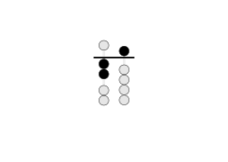
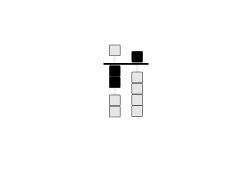
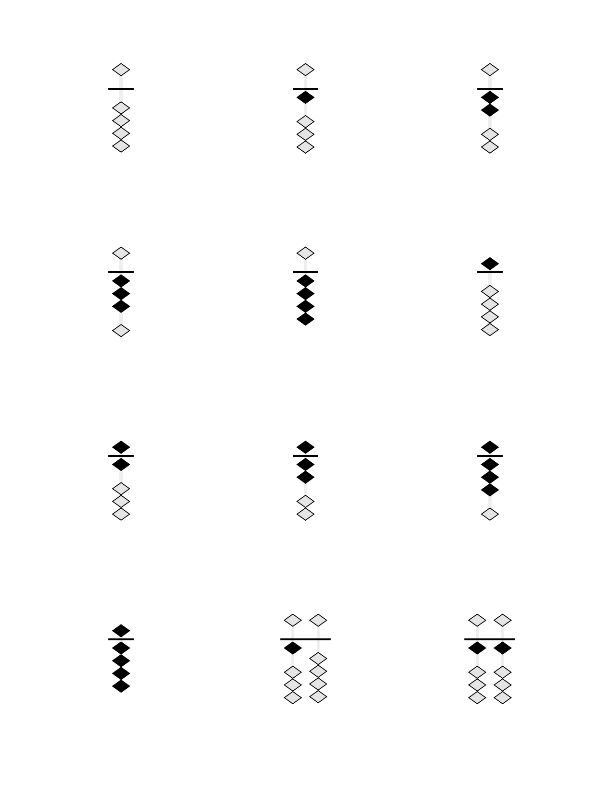

<div align="center">

# 🧮 Soroban Flashcard Generator
### *Master the Ancient Art of Mental Math*

<p align="center">
<br>
<em>Transform numbers into beautiful, interactive learning experiences</em>
</p>

**The ultimate toolkit for learning soroban (Japanese abacus) calculation**  
🎯 Perfect for students, teachers, and mental math enthusiasts  
🚀 From zero to calculation ninja in record time  
🎨 Stunning visuals meet ancient wisdom  

</div>

---

Create **gorgeous flashcards**, **interactive web games**, and **immersive quizzes** that make learning soroban addictive. Whether you're teaching a classroom or mastering mental math yourself, this generator transforms traditional number learning into a vibrant, engaging adventure.

**🔥 What makes this special:**
- **Visual perfection**: Crystal-clear soroban representations with authentic bead positioning
- **Game-changing interactivity**: Memory challenges, sorting games, and smart input systems
- **Universal compatibility**: Generate PDFs, web apps, PNGs, SVGs - whatever you need
- **Colorblind-friendly**: Thoughtfully designed palettes ensure everyone can learn
- **Instant deployment**: One command creates complete learning environments

## 🎨 Visual Gallery

<div align="center">

### Experience the Beauty of Mathematical Precision

<table>
<tr>
<td align="center">
<br>
<strong>🌿 Nature Palette</strong><br>
<em>Earth tones for focused learning</em>
</td>
<td align="center">
<br>
<strong>👁️ Universal Access</strong><br>
<em>Colorblind-friendly brilliance</em>
</td>
<td align="center">
<br>
<strong>🧠 Memory Master</strong><br>
<em>Colors that stick in your mind</em>
</td>
</tr>
</table>

*Each bead precisely positioned, every color carefully chosen, all interactions thoughtfully designed.*

</div>

---

## Examples

<table>
<tr>
<td align="center">
<br>
<b>Soroban (Front)</b>
</td>
<td align="center">
<br>
<b>Numeral (Back)</b>
</td>
<td align="center">
<br>
<b>Place-Value Colors</b>
</td>
<td align="center">
<br>
<b>Colored Numerals</b>
</td>
</tr>
</table>

### Bead Shapes

<table>
<tr>
<td align="center">
<br>
<b>Diamond (Realistic)</b>
</td>
<td align="center">
<br>
<b>Circle (Traditional)</b>
</td>
<td align="center">
<br>
<b>Square</b>
</td>
</tr>
</table>

### Layouts and Options

<table>
<tr>
<td align="center">
<br>
<b>6 Cards Per Page</b>
</td>
<td align="center">
<br>
<b>12 Cards Per Page</b>
</td>
</tr>
<tr>
<td align="center">
<br>
<b>Skip Counting by 5s</b>
</td>
<td align="center">
<br>
<b>Hidden Inactive Beads</b>
</td>
</tr>
</table>

### Printing Features

<table>
<tr>
<td align="center">
<br>
<b>Cutting Guides</b><br>
<i>Full-page guides for accurate card separation</i>
</td>
<td align="center">
<br>
<b>With Registration Marks</b><br>
<i>Alignment marks for duplex printing verification</i>
</td>
</tr>
</table>

## Output Formats

### 📱 Interactive Web Flashcards (`--format web`)

Generate self-contained HTML files with advanced interactive features:

```bash
# Generate interactive web flashcards
python3 src/generate.py --format web --range 0-99 --output flashcards.html

# Try the quiz mode
python3 src/generate.py --format web --range 0-50 --shuffle
```

**Web Features:**
- **🃏 Digital Flashcards**: Hover to reveal numbers, click to flip cards
- **🧠 Timed Quiz Mode**: Configurable display times (0.5-10 seconds), multiple card counts (5, 10, 15, 25, All)
- **📊 Smart Scoring**: Fair scoring algorithm, progress tracking, detailed results
- **🎯 Sorting Challenge**: Drag-and-drop number sorting with gap-filling logic
- **🎮 Matching Pairs**: Memory game matching abacus patterns with numerals
  - Single & two-player modes with competitive scoring
  - Multiple grid sizes (3×4, 4×4, 4×6, 5×6) for different skill levels
  - Turn-based timers and player indicators for multiplayer games
  - Efficiency-based medal system (Gold/Silver/Bronze achievements)
- **📱 Responsive Design**: Works on desktop, tablet, and mobile
- **🖨️ PDF Integration**: Automatically suggests high-quality PDF format when printing is attempted
- **♿ Accessible**: Keyboard navigation, semantic HTML, ARIA labels
- **🎨 Full Customization**: All color schemes, bead shapes, and display options supported

### 📄 Vector PDF (`--format pdf`)

High-quality vector PDFs optimized for duplex printing:

```bash
# Standard PDF with cut marks
python3 src/generate.py --format pdf --range 0-99 --cut-marks --registration
```

**PDF Features:**
- Pure vector graphics for crisp output at any scale
- Duplex printing alignment with registration marks
- Cutting guides for precise card separation
- Embedded fonts ensure consistent output

### 🖼️ PNG/SVG Images (`--format png`, `--format svg`)

Individual card images for digital use or custom layouts:

```bash
# Generate PNG cards at high resolution
python3 src/generate.py --format png --range 1-10 --dpi 300 --transparent

# Generate SVG cards for web use
python3 src/generate.py --format svg --range 0-99 --separate
```

**Image Features:**
- High-resolution PNG (configurable DPI)
- Scalable SVG with embedded CSS
- Transparent backgrounds supported
- Separate front/back organization

## Features

### 🎓 Learning & Teaching Tools
- **🧠 Interactive Quiz Mode**: Timed flashcard quizzes with configurable display times and scoring
- **🎯 Sorting Challenges**: Drag-and-drop number sorting games with intelligent gap-filling
- **🎮 Matching Pairs Game**: Memory challenges matching soroban patterns with numerals
  - **Single Player**: Focus mode with efficiency scoring and medal achievements
  - **Two Player**: Competitive multiplayer with turn timers and player tracking
  - **Adaptive Difficulty**: 4 grid sizes (6-30 pairs) scaling with skill level
  - **Smart Validation**: Prevents invalid moves, guides learning progression
- **📊 Progress Tracking**: Real-time feedback, scoring, and performance analytics
- **📱 Multi-Device Support**: Responsive design works on desktop, tablet, and mobile

### 🎨 Visual Customization
- **🎯 Pure vector graphics** - Crisp output at any scale, all formats
- **🎨 Color schemes** - Educational colors for place-value, heaven-earth, alternating
- **🌈 Colored numerals** - Match numeral colors to bead colors for reinforcement
- **🔷 Customizable beads** - Diamond (realistic), circle, or square shapes
- **🔀 Minimalist mode** - Hide inactive beads for cleaner displays

### 📋 Flexible Content
- **🔢 Flexible ranges** - Any range (0-9999+) or custom lists (1,2,5,10,20,50,100)
- **📈 Skip counting** - Count by 2s, 5s, 10s, or any increment
- **🎲 Shuffling** - Randomize with optional seeds for reproducible builds
- **📊 Smart scaling** - Automatic column management and font sizing

### 🖨️ Print & Production
- **📏 Configurable layouts** - 1 to 30+ cards per page with automatic scaling
- **🖨️ Duplex printing ready** - Automatic front/back alignment for double-sided printing
- **✂️ Cutting guides** - Full-page guides and registration marks for accurate separation
- **🔤 Embedded fonts** - Bundled DejaVu Sans for consistent cross-platform output

### 🔧 Integration & Formats
- **📱 Web HTML** - Self-contained interactive flashcards with quiz modes
- **📄 Vector PDF** - High-quality print-ready documents
- **🖼️ PNG/SVG** - Individual card images for digital use
- **📦 Node.js/TypeScript** - Clean API for web applications
- **🌐 REST API** - FastAPI server for web services
- **⚙️ CLI Interface** - Powerful command-line tool with extensive options

## Quick Start

### Prerequisites

- macOS (tested on latest versions)
- Python 3 (included with macOS)
- Typst (PDF generation engine)
- qpdf (optional, for linearization)

### Installation

```bash
# Install dependencies
make install

# Or manually:
brew install typst qpdf
pip3 install pyyaml
```

### Generate Flashcards

```bash
# Generate default set (0-9)
make

# Generate from config file
python3 src/generate.py --config config/0-99.yaml

# Custom range
python3 src/generate.py --range 0-99

# Custom list of numbers
python3 src/generate.py --range "1,2,5,10,20,50,100"

# With shuffle
python3 src/generate.py --range 0-99 --shuffle --seed 42
```

## 📚 Component Documentation

Explore our comprehensive component documentation and interactive examples:

<div align="center">

### 🎨 Storybook Documentation

<table>
<tr>
<td align="center">
<a href="https://antialias.github.io/soroban-abacus-flashcards/web/" style="text-decoration: none;">
<strong>🌐 Web Application</strong><br>
<em>Complete web app components</em><br>
<sub>Games • Tutorials • UI Elements</sub>
</a>
</td>
<td align="center">
<a href="https://antialias.github.io/soroban-abacus-flashcards/abacus-react/" style="text-decoration: none;">
<strong>🧮 Abacus React Component</strong><br>
<em>Interactive abacus library</em><br>
<sub>Props • Stories • Examples</sub>
</a>
</td>
</tr>
</table>

*Browse interactive demos, component APIs, and implementation examples*

</div>

## 🎮 Interactive Learning Games

The web format includes three immersive learning experiences designed to make soroban mastery engaging and fun:

### 🧠 Memory Quiz Challenge
Test your number recognition skills with timed flashcard quizzes:
- **Adaptive Timing**: 0.5-10 second display windows
- **Flexible Difficulty**: 5, 10, 15, 25 cards or full deck
- **Smart Scoring**: Accounts for difficulty and accuracy
- **Progress Tracking**: Real-time feedback and performance analytics

### 🎯 Sorting Master
Develop number sense through drag-and-drop sorting challenges:
- **Intelligent Gap-Filling**: Place cards in the correct sequence
- **Visual Feedback**: Immediate validation and hints
- **Scalable Difficulty**: Choose your challenge level
- **Educational Design**: Reinforces number relationships

### 🎮 Matching Pairs Arena
Memory game combining visual pattern recognition with numerical understanding:

**Single Player Mode:**
- 🏆 **Medal System**: Gold (≤1.5× pairs), Silver (≤2× pairs), Bronze (≤3× pairs)
- 📏 **Four Grid Sizes**: 3×4 (6 pairs), 4×4 (8 pairs), 4×6 (12 pairs), 5×6 (15 pairs)
- ⚡ **Efficiency Scoring**: Rewards optimal play and quick thinking
- 🎯 **Smart Validation**: Only allows valid matches (abacus ↔ numeral)

**Two Player Mode:**
- 👥 **Competitive Multiplayer**: Turn-based gameplay with score tracking
- ⏱️ **Turn Timers**: Optional 15s/30s/60s time limits with visual countdown
- 🏆 **Player Indicators**: Color-coded badges show who found each match
- 🚀 **First Move Grace**: Timer waits for first card flip to begin counting
- 🎨 **Visual Clarity**: De-emphasized matched cards guide continued play

**Technical Features:**
- 📱 **Responsive Design**: Scales perfectly on all devices without scrolling
- 🔄 **One-Click Start**: Integrated mode and grid selection
- 🎨 **Kid-Friendly UX**: Clear visual feedback prevents confusion
- ♿ **Accessible**: Keyboard navigation and semantic HTML

## Configuration

### Using Configuration Files

Create a YAML or JSON file with your preferences:

```yaml
range: "0-99"
cards_per_page: 6
paper_size: "us-letter"
orientation: "portrait"
margins:
  top: "0.5in"
  bottom: "0.5in"
  left: "0.5in"
  right: "0.5in"
gutter: "5mm"
show_cut_marks: true
show_registration: true
font_family: "DejaVu Sans"
font_size: "48pt"
columns: auto
show_empty_columns: false
shuffle: false
seed: 42  # For deterministic shuffling
```

### Command-Line Options

```bash
python3 src/generate.py [OPTIONS]

Options:
  --config, -c FILE           Configuration file (JSON or YAML)
  --range, -r RANGE          Number range (e.g., "0-99") or list (e.g., "1,2,5")
  --step, -s N               Step/increment for ranges (e.g., 2 for even numbers)
  --cards-per-page N         Cards per page (default: 6, supports 1-30+)
  --paper-size SIZE          Paper size (default: us-letter)
  --orientation ORIENT       Page orientation (portrait/landscape)
  --margins T,R,B,L          Margins (e.g., "0.5in,0.5in,0.5in,0.5in")
  --gutter SIZE              Space between cards (default: 5mm)
  --shuffle                  Shuffle the numbers
  --seed N                   Random seed for deterministic shuffle
  --cut-marks                Show cut marks
  --registration             Show registration marks for alignment
  --font-family FONT         Font family (default: DejaVu Sans)
  --font-size SIZE           Font size (default: 48pt, auto-scales)
  --columns N                Soroban columns (auto or number)
  --show-empty-columns       Show leading empty columns
  --hide-inactive-beads      Hide inactive beads (show only active)
  --bead-shape SHAPE         Bead shape (diamond/circle/square)
  --color-scheme SCHEME      Color scheme (monochrome/place-value/heaven-earth/alternating)
  --colored-numerals         Color numerals to match bead colors
  --scale-factor N           Manual scale adjustment (0.1-1.0, default: 0.9)
  --output, -o FILE          Output PDF path (default: out/flashcards.pdf)
  --linearize                Create linearized PDF (default: true)
```

## Soroban Representation

The soroban is rendered with:
- **1 heaven bead** (worth 5) per column
- **4 earth beads** (worth 1 each) per column
- **Active beads** shown in black, moved toward the reckoning bar
- **Inactive beads** shown in light gray, away from the bar
- **Columns** represent place values (ones, tens, hundreds, etc.)

### Column Display Options

- `columns: auto` - Shows minimal columns needed
- `columns: 3` - Always shows 3 columns (e.g., for 0-999)
- `show_empty_columns: true` - Shows leading zeros
- `show_empty_columns: false` - Suppresses leading zeros

## Print Settings

### For Best Results

1. **Paper**: US Letter (8.5" × 11") or A4
2. **Margins**: Default 0.5" works with most printers
3. **Duplex**: Long-edge binding, automatic duplex
4. **Cut marks**: Enable with `--cut-marks` for easier cutting
5. **Registration**: Enable with `--registration` for alignment verification

### Duplex Printing

The PDFs are specifically formatted for double-sided printing:
- **Odd pages (1, 3, 5...)**: Soroban bead diagrams (front of cards)
- **Even pages (2, 4, 6...)**: Arabic numerals (back of cards)
- Pages are properly ordered for **long-edge binding** (standard duplex)
- Back sides are horizontally mirrored to align correctly when flipped

To print double-sided:
1. Open the PDF in your viewer
2. Select Print → Two-Sided → Long-Edge Binding
3. The printer will automatically place numerals on the back of each soroban diagram

### Sample Configurations

- `config/default.yaml` - Basic 0-9 set
- `config/0-99.yaml` - Two-digit numbers with cut marks
- `config/3-column-fixed.yaml` - Three-digit numbers, fixed width
- `config/minimal-beads.yaml` - Hide inactive beads for clarity
- `config/circle-beads.yaml` - Traditional circular beads
- `config/place-value-colors.yaml` - Place value color coding
- `config/colored-numerals.yaml` - Colored numerals matching beads
- `config/count-by-5s.yaml` - Skip counting by 5s

## Project Structure

```
soroban-abacus-flashcards/
├── src/
│   ├── generate.py            # Main CLI tool (all formats)
│   ├── web_generator.py       # Interactive web flashcards with quiz modes
│   ├── bridge.py              # Node.js integration bridge
│   ├── api.py                 # FastAPI REST server
│   └── generate_examples.py   # Example generation utilities
├── templates/
│   └── flashcards.typ         # Typst template with soroban rendering
├── config/                    # Preset configurations
│   ├── default.yaml           # Basic 0-9 set
│   ├── 0-99.yaml             # Two-digit numbers with cut marks
│   ├── place-value-colors.yaml # Educational color coding
│   ├── colored-numerals.yaml  # Matching numeral colors
│   ├── minimal-beads.yaml     # Hide inactive beads
│   ├── circle-beads.yaml      # Traditional circular beads
│   ├── count-by-5s.yaml       # Skip counting by 5s
│   └── 3-column-fixed.yaml    # Fixed-width three-digit display
├── tests/
│   ├── test_generation.py     # Core generation tests
│   ├── test_web_generation.py # Web format tests
│   ├── test_quiz_functionality.py # Interactive quiz tests
│   ├── test_config.py         # Configuration parsing tests
│   └── test_visual.py         # Visual output validation
├── client/                    # Integration libraries
│   ├── node/                  # Node.js/TypeScript wrapper
│   ├── typescript/            # Browser TypeScript client
│   └── browser/               # Browser-based implementation
├── fonts/
│   ├── DejaVuSans.ttf        # Bundled font
│   └── DejaVuSans-Bold.ttf   # Bold variant
├── docs/
│   └── images/               # Example images for README
├── out/                      # Generated outputs (created on first run)
│   ├── *.pdf                # PDF flashcards
│   ├── *.html               # Interactive web flashcards
│   ├── png/                 # PNG card images
│   └── svg/                 # SVG card images
├── Makefile                  # Build automation
└── README.md                # This file
```

## Design Notes

### Soroban Number Mapping

Numbers are decomposed into heaven (5s) and earth (1s) beads:
- **7** = 1 heaven bead (5) + 2 earth beads (2×1)
- **23** = Tens: 4 earth beads (4×1), Ones: 3 earth beads (3×1)
- **156** = Hundreds: 1 heaven + 0 earth, Tens: 1 heaven + 0 earth, Ones: 1 heaven + 1 earth

### Duplex Alignment

- Front cards are laid out left-to-right, top-to-bottom
- Back cards are mirrored horizontally for long-edge binding
- Registration marks (optional) help verify alignment
- Safe margins ensure content isn't lost when cutting

### Vector Graphics

All elements are rendered as vectors using Typst's drawing primitives:
- Beads are vector circles with stroke
- Rods and reckoning bar are vector rectangles
- No rasterization ensures crisp output at any scale

## Troubleshooting

### "typst command not found"
Run `make install` or `brew install typst`

### "qpdf command not found"
PDF will generate but won't be linearized. Install with `brew install qpdf`

### Fonts not embedding
Ensure the `fonts/` directory contains the DejaVu TTF files

### Misaligned duplex printing
- Check printer duplex settings (should be long-edge)
- Enable registration marks with `--registration`
- Verify margins match your printer's capabilities

## Examples

### Quick Start Examples

```bash
# Generate interactive web flashcards (try the quiz!)
python3 src/generate.py --format web --range 0-20 --shuffle

# Generate print-ready PDF with cutting guides
python3 src/generate.py --format pdf --range 0-99 --cut-marks --registration

# Generate high-res PNG cards for digital use
python3 src/generate.py --format png --range 1-10 --dpi 300 --transparent

# Generate place-value colored cards for teaching
python3 src/generate.py --format web --range 0-50 \
  --color-scheme place-value --colored-numerals

# Generate minimal-style cards (hide inactive beads)
python3 src/generate.py --format web --range 0-25 --hide-inactive-beads

# Generate skip-counting practice (count by 5s)
python3 src/generate.py --format web --range 0-100 --step 5
```

### Development & Testing

```bash
# Generate samples
make samples

# Quick test
make test

# Clean all outputs
make clean

# Show help
make help
```

## Node.js/TypeScript Integration

### Installation

```bash
cd client/node
npm install
```

### Usage Example

```typescript
import { SorobanGenerator } from './soroban-generator-bridge';

async function generateFlashcards() {
  const generator = new SorobanGenerator();
  
  // Generate with clean function interface - no CLI args!
  const result = await generator.generate({
    range: '0-99',
    cardsPerPage: 6,
    colorScheme: 'place-value',
    coloredNumerals: true,
    showCutMarks: true
  });
  
  // Get PDF as Buffer
  const pdfBuffer = Buffer.from(result.pdf, 'base64');
  
  // Save to file or send to client
  await fs.writeFile('flashcards.pdf', pdfBuffer);
}
```

### Express.js Integration

```typescript
import express from 'express';
import { SorobanGenerator } from './soroban-generator-bridge';

const app = express();
const generator = new SorobanGenerator();

app.post('/api/flashcards', async (req, res) => {
  // Direct function call - no shell commands!
  const result = await generator.generate(req.body);
  const pdfBuffer = Buffer.from(result.pdf, 'base64');
  
  res.contentType('application/pdf');
  res.send(pdfBuffer);
});
```

### API Reference

The `SorobanGenerator` class provides:

- `generate(config)` - Returns `{ pdf: string, count: number, numbers: number[] }`
- `generateBuffer(config)` - Returns PDF as Node.js Buffer
- `initialize()` - Start persistent Python process for better performance
- `close()` - Clean up Python process

All methods use clean TypeScript interfaces with proper types - no shell command building required!

## REST API Server

For web services and remote generation:

### Start the API Server

```bash
# Install FastAPI dependencies
pip3 install fastapi uvicorn

# Start the development server
python3 src/api.py
# or
uvicorn src.api:app --reload --host 0.0.0.0 --port 8000
```

### API Endpoints

```bash
# Generate flashcards via POST
curl -X POST "http://localhost:8000/generate" \
  -H "Content-Type: application/json" \
  -d '{
    "range": "0-99",
    "format": "web",
    "color_scheme": "place-value",
    "cards_per_page": 6
  }'

# Health check
curl http://localhost:8000/health

# OpenAPI documentation available at:
# http://localhost:8000/docs (Swagger UI)
# http://localhost:8000/redoc (ReDoc)
```

### API Features

- **🔄 All formats supported**: PDF, PNG, SVG, and interactive web HTML
- **📊 JSON responses**: Base64-encoded files with metadata
- **🛡️ CORS enabled**: Ready for web app integration
- **📚 Auto documentation**: OpenAPI/Swagger specs included
- **⚡ High performance**: Optimized for production workloads

## Development

### 📦 NPM Package Publishing

The `@soroban/abacus-react` package is automatically published to npm using semantic versioning. To trigger a release:

```bash
# For new features (minor version bump)
git commit -m "feat(abacus-react): add new bead animation system"

# For bug fixes (patch version bump)
git commit -m "fix(abacus-react): resolve gesture detection issue"

# For breaking changes (major version bump)
git commit -m "feat(abacus-react)!: change callback signature"
```

**Important**: Use the `(abacus-react)` scope in commit messages to trigger package releases. Regular commits without this scope only affect the monorepo versioning.

📖 **Full details**: See [CONTRIBUTING.md](./CONTRIBUTING.md#package-specific-publishing) for complete workflow documentation.

### Updating Example Images

If you make changes that affect the visual output, please update the example images:

```bash
# Regenerate all example images
make examples

# Or use the update script
./scripts/update-examples.sh

# Verify examples are up to date (CI will also check this)
make verify-examples
```

The CI pipeline will automatically verify that example images are up to date with the code.

### Running Tests

The project includes comprehensive test coverage for all functionality:

```bash
# Run all tests
python3 -m pytest tests/ -v

# Test specific functionality
python3 -m pytest tests/test_quiz_functionality.py -v  # Interactive quiz features
python3 -m pytest tests/test_web_generation.py -v     # Web format generation
python3 -m pytest tests/test_generation.py -v         # Core generation logic
python3 -m pytest tests/test_config.py -v             # Configuration parsing
python3 -m pytest tests/test_visual.py -v             # Visual output validation

# Quick test build
make test

# Generate all samples
make samples

# Full CI verification (ensures examples are up to date)
make verify-examples
```

### Test Coverage

- **🧠 Quiz Functionality**: Interactive quiz modes, scoring algorithms, progress tracking
- **🎯 Sorting Challenges**: Drag-and-drop mechanics, gap-filling logic, user interactions
- **🌐 Web Generation**: HTML output, CSS styling, JavaScript functionality
- **📄 PDF Generation**: Vector rendering, duplex alignment, cutting guides
- **🖼️ Image Output**: PNG/SVG generation, transparency, resolution scaling
- **⚙️ Configuration**: YAML/JSON parsing, validation, command-line interface
- **🎨 Visual Output**: Color schemes, bead shapes, layout consistency

## License

MIT License - see LICENSE file for details.

This project uses DejaVu Sans font (included), which is released under a free license.