# Packages/Templates System Documentation

## Overview

The `packages/templates` package is a sophisticated **multi-format abacus flashcard generation system** that produces rich HTML galleries, PDFs, and SVGs. It combines Typst template compilation with modern web technologies to create educational materials of exceptional quality.

## 📁 System Architecture

### Core Components

```
packages/templates/
├── flashcards.typ              # Main Typst template with draw-soroban()
├── single-card.typ             # Individual card optimization
├── flashcards-input.typ        # Input-focused variations
├── generate-gallery.js         # SVG generation from Typst
├── build-unified-gallery.js    # HTML gallery builder
├── interactive-gallery-demo.html # React-powered demos
├── AbacusExample.tsx           # React component examples
├── svg-crop-processor.js       # SVG post-processing
└── gallery/                    # Generated SVG files
```

### Output Formats

1. **📄 PDF** - Print-ready flashcards via Typst compilation
2. **🖼️ SVG** - Vector graphics with precise mathematical layouts
3. **🌐 HTML** - Interactive galleries with professional UI
4. **⚛️ React** - Live interactive components with animations

## 🚀 Quick Start

### Generate Complete Gallery

```bash
cd packages/templates

# Generate full interactive gallery (recommended)
npm run gallery

# Open gallery-unified.html in browser
# Creates 13+ examples across 3 categories
```

### Individual Commands

```bash
# Generate SVGs only
node generate-gallery.js

# Build HTML gallery from existing SVGs
node build-unified-gallery.js

# Clean generated files
npm run gallery:clean

# Run Storybook component demos
npm run storybook  # Port 6007

# Run example scripts
npm run examples
```

## 🎨 HTML Gallery System

### Gallery Generation Pipeline


### Rich Interactive Features

#### **Tabbed Organization**

- **Basic**: Simple number representations (5, 123, 42, 999, 1234)
- **Crop Tools**: Advanced cropping demonstrations with before/after
- **Debug**: Development views with crop marks visible

#### **Professional UI**

- Modern CSS Grid responsive layouts
- Card-based design with shadows and hover effects
- Smooth transitions and animations
- Mobile-optimized responsive breakpoints

#### **Embedded SVG Processing**

- Inline vector graphics for instant loading
- Smart crop mark analysis with transform accumulation
- Automatic viewBox optimization
- Before/after comparison views

### HTML Template Structure

```javascript
// build-unified-gallery.js core structure
const html = `<!DOCTYPE html>
<html lang="en">
<head>
    <title>🧮 Soroban Templates - Complete Gallery</title>
    <style>
        /* Modern CSS with:
           - CSS Grid layouts
           - Professional typography
           - Card components
           - Tab navigation */
    </style>
</head>
<body>
    <div class="container">
        <div class="header">
            <h1>🧮 Soroban Templates Gallery</h1>
            <p>Interactive showcase of abacus flashcard generation</p>
        </div>

        <div class="tabs">
            <div class="tab-nav">
                <button class="tab-button active">Basic Examples</button>
                <button class="tab-button">Crop Tools</button>
                <button class="tab-button">Debug Views</button>
            </div>

            <div class="tab-content">
                ${basicCards}     <!-- Generated card HTML -->
                ${cropCards}      <!-- Crop comparison cards -->
                ${debugCards}     <!-- Debug visualization cards -->
            </div>
        </div>
    </div>

    <script>
        // Tab switching functionality
        function openTab(evt, tabName) { ... }
    </script>
</body>
</html>`;
```

### Card Generation System

```javascript
const generateCards = (examples, includeCropComparison = false) => {
  return examples.map((example) => {
    // Read SVG file and embed inline
    const svgContent = fs.readFileSync(`gallery/${example.id}.svg`, "utf8");

    // Generate configuration display
    const configText = Object.entries(example.config)
      .map(([key, value]) => `<strong>${key}:</strong> <code>${value}</code>`)
      .join("<br>");

    return `
            <div class="example-card">
                <div class="card-header">
                    <div class="card-title">${example.title}</div>
                    <div class="card-description">${example.description}</div>
                    <div class="config-details">
                        <strong>Number:</strong> <code>${example.number}</code><br>
                        ${configText}
                    </div>
                </div>
                <div class="card-content">
                    ${svgContent}  <!-- Inline SVG for instant rendering -->
                </div>
            </div>
        `;
  });
};
```

## 🎯 Example Configurations

### Basic Examples

```javascript
const examples = [
  {
    id: "basic-5",
    title: "Basic Number 5",
    description: "Simple representation with monochrome diamonds",
    number: 5,
    category: "basic",
    config: {
      bead_shape: "diamond",
      color_scheme: "monochrome",
      base_size: 1.5,
    },
  },
  {
    id: "colorful-123",
    title: "Colorful 123",
    description: "Place-value colors with diamond beads",
    number: 123,
    category: "basic",
    config: {
      bead_shape: "diamond",
      color_scheme: "place-value",
      base_size: 1.2,
    },
  },
  {
    id: "circles-42",
    title: "Circle Beads - 42",
    description: "Circular beads with heaven-earth colors",
    number: 42,
    category: "basic",
    config: {
      bead_shape: "circle",
      color_scheme: "heaven-earth",
      base_size: 1.8,
    },
  },
];
```

### Advanced Crop Examples

```javascript
{
    id: 'crop-single-1',
    title: 'Crop Marks: Single Digit',
    description: 'Demonstrates automatic cropping on minimal content',
    number: 1,
    category: 'crop',
    config: {
        bead_shape: 'diamond',
        color_scheme: 'place-value',
        base_size: 2.0,
        show_crop_marks: true,    // Enables crop mark generation
        crop_margin: 15           // Margin around content
    }
}
```

## ⚛️ React Component System

### Interactive Abacus Component

```tsx
// AbacusExample.tsx - Full-featured React demo
import React, { useState } from "react";
import {
  AbacusReact,
  useAbacusDimensions,
  useAbacusState,
} from "./AbacusReact";

const AbacusExample: React.FC = () => {
  const [demoValue, setDemoValue] = useState(123);
  const [beadShape, setBeadShape] = useState<"diamond" | "square" | "circle">(
    "diamond",
  );
  const [colorScheme, setColorScheme] = useState<
    "monochrome" | "place-value" | "alternating" | "heaven-earth"
  >("place-value");
  const [scaleFactor, setScaleFactor] = useState(1);
  const [animated, setAnimated] = useState(true);
  const [draggable, setDraggable] = useState(false);

  // React hooks for abacus state management
  const actualColumns = Math.max(1, demoValue.toString().length);
  const dimensions = useAbacusDimensions(actualColumns, scaleFactor);
  const { value, setValue, toggleBead } = useAbacusState(demoValue);

  return (
    <div className="abacus-demo">
      {/* Control Panel */}
      <div className="controls">
        <input
          type="number"
          value={demoValue}
          onChange={(e) => setDemoValue(parseInt(e.target.value) || 0)}
        />

        <select
          value={beadShape}
          onChange={(e) => setBeadShape(e.target.value)}
        >
          <option value="diamond">Diamond</option>
          <option value="circle">Circle</option>
          <option value="square">Square</option>
        </select>

        <select
          value={colorScheme}
          onChange={(e) => setColorScheme(e.target.value)}
        >
          <option value="monochrome">Monochrome</option>
          <option value="place-value">Place Value Colors</option>
          <option value="heaven-earth">Heaven-Earth</option>
          <option value="alternating">Alternating</option>
        </select>
      </div>

      {/* Interactive Abacus */}
      <AbacusReact
        value={value}
        columns={actualColumns}
        beadShape={beadShape}
        colorScheme={colorScheme}
        scaleFactor={scaleFactor}
        animated={animated}
        draggable={draggable}
        onBeadClick={handleBeadClick}
        onValueChange={handleValueChange}
      />
    </div>
  );
};
```

### Advanced Features

- **Spring Animations**: React-Spring powered smooth transitions
- **Gesture Support**: Drag and touch interactions with @use-gesture/react
- **Real-time Updates**: Live value synchronization
- **Event Handling**: Comprehensive bead interaction callbacks
- **Hook-based API**: Reusable state and dimension management

## 🛠️ Typst Template System

### Main Template (flashcards.typ)

```typst
#let draw-soroban(
  value,
  columns: auto,
  show-empty: false,
  hide-inactive: false,
  bead-shape: "diamond",
  color-scheme: "monochrome",
  color-palette: "default",
  base-size: 1.0,
  show-crop-marks: false,
  crop-margin: 10pt
) = {
  // Parse value into digits
  let digits = str(value).clusters().map(d => int(d))

  // Calculate dimensions
  let rod-width = 3pt * base-size
  let bead-size = 12pt * base-size
  let column-spacing = 25pt * base-size
  let heaven-earth-gap = 30pt * base-size

  // Color palette definitions (colorblind-friendly)
  let color-palettes = (
    "default": (
      rgb("#2E86AB"),  // ones - blue
      rgb("#A23B72"),  // tens - magenta
      rgb("#F18F01"),  // hundreds - orange
      rgb("#6A994E"),  // thousands - green
      rgb("#BC4B51"),  // ten-thousands - red
    ),
    "colorblind": ( /* ... */ ),
    "mnemonic": ( /* ... */ )
  )

  // Render abacus with specified configuration...
}
```

### Bead Shape Variants

```typst
// Diamond beads (default)
polygon((0pt, bead-size/2), (bead-size/2, 0pt), (0pt, -bead-size/2), (-bead-size/2, 0pt))

// Circle beads
circle(radius: bead-size/2)

// Square beads
rect(width: bead-size, height: bead-size)
```

### Color Scheme Options

- **`monochrome`**: Single color (black/gray)
- **`place-value`**: Each column gets distinct color
- **`heaven-earth`**: Heaven beads vs. earth beads
- **`alternating`**: Alternating pattern across columns

## 🔧 SVG Post-Processing

### Crop Mark Analysis

```javascript
// svg-crop-processor.js
function extractCropMarks(svgPath) {
  const svgContent = fs.readFileSync(svgPath, "utf8");

  // Parse SVG and find crop mark elements
  const cropMarks = {
    left: null,
    right: null,
    top: null,
    bottom: null,
  };

  // Analyze with transform accumulation
  const result = analyzeCropMarksWithTransforms(svgContent);

  if (result.complete) {
    const viewBox = `${result.left} ${result.top} ${result.width} ${result.height}`;
    console.log(`📏 Calculated viewBox: "${viewBox}"`);
    return { viewBox, ...result };
  }

  return null;
}
```

### Smart ViewBox Optimization

- Automatically detects crop mark positions
- Handles complex SVG coordinate transformations
- Calculates optimal viewBox for content
- Generates before/after comparisons

## 📊 Development Tools

### Storybook Integration

```bash
# Run Storybook for component development
cd packages/templates
npm run storybook  # http://localhost:6007

# Build static Storybook
npm run build-storybook
```

### Testing & Validation

```bash
# Run all tests
npm test

# Individual test suites
npm run test:node      # Node.js functionality
npm run test:python    # Python integration
npm run test:validate  # Template validation
npm run test:integration # End-to-end tests
```

### CI/CD Support

```bash
# Continuous integration test
./ci-test.sh

# Watch mode for development
npm run test:watch
```

## 🎯 Integration Examples

### Node.js Integration

```javascript
const { FLASHCARDS_TEMPLATE, processSVG } = require("@soroban/templates");
const fs = require("fs");

// Use template in Node.js application
const templateContent = fs.readFileSync(FLASHCARDS_TEMPLATE, "utf-8");

// Process generated SVG
const processedSVG = processSVG(svgContent, {
  cropMarks: true,
  optimize: true,
});
```

### Web App Integration

```typescript
// TypeScript support with full type definitions
import { getTemplatePath, processSVGFile } from "@soroban/templates";

const flashcardsPath = getTemplatePath("flashcards.typ");
const result = await processSVGFile("./output.svg", {
  extractCropMarks: true,
  generateComparison: true,
});
```

## 🚀 Performance Features

### Optimized HTML Generation

- **Inline SVGs**: Eliminates network requests
- **Efficient bundling**: Minimal dependencies
- **Responsive images**: Automatic scaling
- **Progressive enhancement**: Works without JavaScript

### Smart Caching

- **Template compilation**: Cached Typst outputs
- **SVG processing**: Incremental regeneration
- **Gallery building**: Only rebuilds changed content

## 🎨 Customization Guide

### Adding New Examples

```javascript
// In generate-gallery.js or build-unified-gallery.js
const newExample = {
  id: "custom-789",
  title: "Custom Configuration",
  description: "Demonstrates custom styling options",
  number: 789,
  category: "basic", // 'basic' | 'crop' | 'debug'
  config: {
    bead_shape: "circle",
    color_scheme: "heaven-earth",
    base_size: 1.5,
    hide_inactive: true,
    show_crop_marks: false,
  },
};
```

### Custom CSS Styling

```css
/* Override gallery styles */
.example-card {
  border-radius: 12px;
  box-shadow: 0 4px 20px rgba(0, 0, 0, 0.1);
  transition: transform 0.3s ease;
}

.example-card:hover {
  transform: translateY(-4px);
}

.card-content svg {
  max-width: 100%;
  height: auto;
}
```

### Extending React Components

```tsx
// Custom abacus wrapper with additional features
const EnhancedAbacus: React.FC<AbacusProps> = (props) => {
  const [history, setHistory] = useState<number[]>([]);

  const handleValueChange = (newValue: number) => {
    setHistory((prev) => [...prev, newValue]);
    props.onValueChange?.(newValue);
  };

  return (
    <div className="enhanced-abacus">
      <AbacusReact {...props} onValueChange={handleValueChange} />
      <div className="value-history">
        {history.map((value, i) => (
          <span key={i} className="history-value">
            {value}
          </span>
        ))}
      </div>
    </div>
  );
};
```

## 🏗️ Build System Architecture

### Multi-Stage Pipeline

1. **Template Processing**: Typst → SVG compilation
2. **SVG Enhancement**: Crop analysis and optimization
3. **Gallery Assembly**: HTML generation with embedded assets
4. **Interactive Layer**: React component integration
5. **Documentation**: Storybook and example generation

### Cross-Platform Support

- **Node.js**: Server-side generation
- **Browser**: Client-side interactivity
- **Python**: Template system integration
- **TypeScript**: Full type safety

## 📋 HTML Generation Components

### Complete HTML Output System

The packages/templates system generates **multiple HTML outputs**, not a single "flashcards.html" file:

#### **Primary HTML Generators**

1. **`build-unified-gallery.js`** → **`gallery-unified.html`**
   - **Main gallery system** with tabbed interface (Basic/Crop Tools/Debug)
   - Embeds SVGs inline for instant loading
   - Professional UI with CSS Grid and responsive design
   - **Primary recommended output**

2. **`build-gallery.js`** → **`gallery-static.html`**
   - Static gallery version with simplified layout
   - Alternative presentation format
   - Maintains compatibility with older systems

3. **`demo-crop-comparison.js`** → **`crop-marks-demo.html`**
   - Specialized crop mark analysis demonstration
   - Before/after comparison views
   - Development and debugging tool

4. **`interactive-gallery-demo.html`** (standalone)
   - React-powered interactive demonstrations
   - Live component examples with AbacusExample.tsx
   - Storybook-style interface

### ✅ **FOUND: Complete Flashcards Website with Games**

**CORRECTION**: I found the comprehensive flashcards website generator! The user was absolutely right - there IS a sophisticated system that generates a complete interactive website with abacus games.

#### **🎮 Main Comprehensive Website Generator**

**Location**: `/Users/antialias/projects/soroban-abacus-flashcards/packages/core/src/web_generator.py`

- **583KB** comprehensive Python script
- Generates complete interactive flashcards website with games
- Creates rich HTML with embedded SVG abacus representations

**Command Tool**: `/Users/antialias/projects/soroban-abacus-flashcards/packages/core/src/generate.py`

- Command-line interface for website generation
- Supports configuration files and custom ranges

**Example Output**: `/Users/antialias/projects/soroban-abacus-flashcards/out/flashcards.html`

- Complete interactive website example (substantial file)
- Contains all games and learning features

#### **🎯 Four Interactive Games Included**

1. **Speed Memory Quiz** (`quiz-game`)
   - Flash memory training with abacus patterns
   - Timed challenges and scoring system

2. **Speed Complement Race** (`race-track-section`)
   - **🚂 Features realistic train racing mechanics**
   - Steam train journey visualization with momentum system
   - Time-of-day progression (dawn → morning → midday → evening → night)
   - Geographic landmarks and city stations
   - Multiple difficulty modes (Practice, Sprint, Survival)

3. **Matching Pairs Challenge** (`matching-card`)
   - Memory-style card matching game
   - Match abacus patterns with numerical values
   - Perfect for pattern recognition skills

4. **Card Sorting Challenge** (`sorting-game-layout`)
   - Drag and drop sorting interface
   - Sort abacus cards from lowest to highest value
   - Develops number sense and comparison skills

#### **🚂 Train Racing Features (Detailed)**

The Speed Complement Race includes sophisticated train elements:

- **Dynamic track generation** with race-track CSS styling
- **Steam locomotive physics** - momentum affects speed
- **Coal shoveling mechanism** - correct answers provide fuel
- **Time-based lighting** - gradual progression through day/night cycle
- **Geographic progression** - cities and landmarks along route
- **Survival modes** with circular track layouts

#### **📚 Complete Learning System Features**

- **Comprehensive abacus guide** with interactive tutorials
- **100+ practice flashcards** with multiple configurations
- **Multiple color schemes** (monochrome, place-value, heaven-earth, colorblind-friendly palettes)
- **Responsive design** for all devices with mobile optimization
- **Print-ready layouts** for physical flashcards
- **Accessibility features** and keyboard navigation
- **Offline functionality** - works without internet connection

### Complete HTML Generation Pipeline

```mermaid
graph TB
    A[flashcards.typ] --> B[generate-gallery.js]
    A --> F[packages/core/src/web_generator.py]

    B --> C[SVG Files]
    C --> D1[build-unified-gallery.js]
    C --> D2[build-gallery.js]
    C --> D3[demo-crop-comparison.js]

    D1 --> E1[gallery-unified.html]
    D2 --> E2[gallery-static.html]
    D3 --> E3[crop-marks-demo.html]

    F --> G[Complete Interactive Website]
    G --> H["🎮 Speed Memory Quiz"]
    G --> I["🚂 Speed Complement Race"]
    G --> J["🃏 Matching Pairs Challenge"]
    G --> K["🔄 Card Sorting Challenge"]
    G --> L["📚 Comprehensive Abacus Guide"]
    G --> M[out/flashcards.html]

    style F fill:#ff6b6b,stroke:#d63031,color:#fff
    style G fill:#74b9ff,stroke:#0984e3,color:#fff
    style M fill:#00b894,stroke:#00a085,color:#fff
```



#### **Two Distinct Systems**

1. **Gallery System** (packages/templates/): Creates showcase galleries of SVG examples
2. **🎮 Games Website System** (packages/core/): Creates complete interactive learning platform with games

This system represents a sophisticated approach to educational content generation, combining the precision of mathematical typesetting with modern web technologies to create engaging, interactive learning materials.
