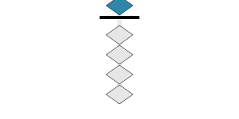
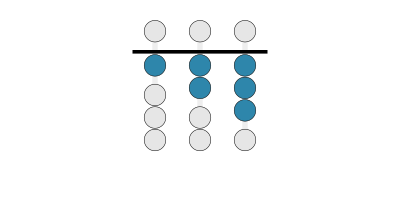
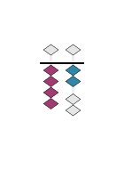

# @soroban/templates

> Shared Typst templates for Soroban abacus flashcard generation

A clean, dual-interface package providing Typst templates for generating soroban abacus visualizations in both Node.js/TypeScript and Python environments.

## ⚡ Quick Start

**Get production-ready soroban templates in under 60 seconds:**

### 📦 Install

```bash
pnpm add @soroban/templates    # or npm install @soroban/templates
```

### 🟨 Node.js/TypeScript (Next.js, Express, etc.)

```typescript
import { FLASHCARDS_TEMPLATE, getTemplatePath } from "@soroban/templates";
import fs from "fs";

// Method 1: Direct path (most common)
const template = fs.readFileSync(FLASHCARDS_TEMPLATE, "utf-8");

// Method 2: Dynamic resolution (webpack-safe)
const templatePath = getTemplatePath("flashcards.typ");
const template = fs.readFileSync(templatePath, "utf-8");

// Use with your Typst compiler...
// const svg = await typst.compile(template, { number: 1234 });
```

### 🐍 Python (CLI tools, scripts)

```python
from soroban_templates import FLASHCARDS_TEMPLATE, verify_templates

# Verify templates are ready
verify_templates()  # Throws if anything is wrong

# Load and use
with open(FLASHCARDS_TEMPLATE, 'r') as f:
    template = f.read()

# Use with Typst CLI...
# subprocess.run(['typst', 'compile', FLASHCARDS_TEMPLATE, 'output.pdf'])
```

**What you get:**

- ✅ `flashcards.typ` - Full-featured soroban template with `draw-soroban()` function
- ✅ `single-card.typ` - Optimized single card template
- ✅ Webpack compatibility (Next.js, Vite, etc.)
- ✅ Monorepo support (PNPM workspaces, uv)
- ✅ TypeScript definitions included

[Jump to examples →](#-usage-examples) • [See renderings →](#-example-renderings) • [See all features →](#-template-features)

## 🎨 Example Renderings

Here are some sample outputs from the templates to show what you can generate:

### Number 5 - Place Value Colors with Diamond Beads



**Template used:** `flashcards.typ`
**Configuration:** `draw-soroban(5, bead-shape: "diamond", color-scheme: "place-value")`

### Number 123 - Heaven-Earth Colors with Circle Beads



**Template used:** `flashcards.typ`
**Configuration:** `draw-soroban(123, bead-shape: "circle", color-scheme: "heaven-earth")`

### Single Card - Number 42



**Template used:** `single-card.typ`
**Configuration:** `generate-single-card(42, side: "front", color-scheme: "place-value")`

> 💡 **Tip:** All templates support multiple bead shapes (`diamond`, `circle`, `square`), color schemes (`monochrome`, `place-value`, `heaven-earth`, `alternating`), and various customization options.

## 📋 Template Features

### `flashcards.typ` - Full Featured Template

- **Core Function**: `draw-soroban(value, ...options)`
- **Bead Shapes**: `diamond`, `circle`, `square`
- **Color Schemes**: `monochrome`, `place-value`, `heaven-earth`, `alternating`
- **Color Palettes**: `default`, `colorblind`, `mnemonic`, `grayscale`, `nature`
- **Advanced Options**:
  - Hide inactive beads
  - Show empty columns
  - Custom column counts
  - Scale factors
  - Interactive bead annotations
  - **Crop marks**: Invisible viewBox boundaries for consistent SVG cropping

### `single-card.typ` - Optimized Single Cards

- **Function**: `generate-single-card(number, side, ...options)`
- **Sides**: `front` (soroban), `back` (numeral)
- **PNG Export Ready**: Transparent backgrounds supported
- **Custom Dimensions**: Configurable width/height
- **Font Options**: Family, size, colored numerals
- **Crop marks**: Invisible viewBox boundaries for consistent SVG cropping

## 🎯 Crop Marks & SVG Processing

Both templates include **crop marks** - invisible elements that define precise boundaries for consistent viewBox handling, eliminating the need for manual SVG cropping.

### Crop Marks System

- **Purpose**: Define consistent viewBox boundaries across all generated SVGs
- **Implementation**: Invisible rectangles placed at the four corners and center
- **Annotation**: Each crop mark is annotated using `link("crop-mark://position", element)`
- **Debugging**: Set `show-crop-marks: true` to make marks visible in red

### Usage

```typst
// flashcards.typ - invisible crop marks (default)
#draw-soroban(123, show-crop-marks: false, crop-margin: 10pt)

// flashcards.typ - visible crop marks for debugging
#draw-soroban(123, show-crop-marks: true, crop-margin: 15pt)

// single-card.typ - invisible crop marks (default)
#generate-single-card(42, show-crop-marks: false, crop-margin: 10pt)

// single-card.typ - visible crop marks for debugging
#generate-single-card(42, show-crop-marks: true, crop-margin: 15pt)
```

### Link Annotation System

Both templates use Typst's `link()` function to annotate elements for post-processing:

- **Beads**: `link("bead://column-position-type", bead-element)`
- **Crop Marks**: `link("crop-mark://position", mark-element)`

**Note**: Link annotations are exported to PDF format but not SVG. For SVG processing, the crop marks work as invisible positioning elements that can be identified by their precise coordinates and styling.

Example annotations in generated PDFs:

- `bead://col1-ones-heaven` - Heaven bead in column 1, ones position
- `bead://col2-tens-earth-1` - First earth bead in column 2, tens position
- `crop-mark://top` - Top edge crop boundary
- `crop-mark://bottom` - Bottom edge crop boundary
- `crop-mark://left` - Left edge crop boundary
- `crop-mark://right` - Right edge crop boundary
- `crop-mark://center` - Center reference point

## 🔧 SVG Post-Processing (Recommended)

**@soroban/templates** includes a comprehensive SVG post-processor that automatically optimizes Typst-generated SVGs by:

✅ **Crop mark detection & viewBox optimization** - Eliminates excess canvas space
✅ **Interactive bead annotation extraction** - Converts bead links to HTML5 data attributes
✅ **Automatic width/height adjustment** - Maintains proper aspect ratios
✅ **Browser & Node.js compatibility** - Works everywhere with zero dependencies

### Quick Start

```javascript
import { processSVG } from "@soroban/templates";
import fs from "fs";

// Process SVG with full optimization
const svgContent = fs.readFileSync("soroban.svg", "utf-8");
const result = processSVG(svgContent, {
  extractBeadAnnotations: true, // Convert bead:// links to data attributes
  preserveAspectRatio: true, // Update width/height to match viewBox
  removeCropMarks: false, // Keep crop marks for debugging
});

// Save optimized SVG
fs.writeFileSync("optimized.svg", result.svg);

console.log(`✨ Optimized! Size reduction: ${result.cropData.reduction}%`);
console.log(`🎯 Found ${result.beadData?.count || 0} interactive beads`);
console.log(`📏 New viewBox: ${result.cropData.viewBox}`);
```

### Before/After Example

**Input SVG (270×210px canvas):**

```svg
<svg viewBox="0 0 270 210" width="270pt" height="210pt">
  <!-- Full canvas with excess whitespace -->
  <g transform="translate(97.5 17.5)">
    <!-- Soroban content -->
  </g>
</svg>
```

**Output SVG (optimized 58×136px):**

```svg
<svg viewBox="78.7 11 58.6 136.4" width="58.6pt" height="136.4pt"
     data-crop-reduction="67%">
  <!-- Optimized canvas, cropped to content -->
  <path data-bead-id="heaven-col1-active1"
        data-bead-type="heaven"
        data-bead-column="1"
        data-bead-active="true"
        fill="#2e86ab" d="M 21 0 L 42 15..."/>
</svg>
```

### API Reference

```typescript
import {
  processSVG, // Main processing function
  processSVGFile, // Browser File/Blob processing
  extractCropMarks, // Crop optimization only
  extractBeadAnnotations, // Bead processing only
  SVGCropError, // Error class
} from "@soroban/templates";

// Process with options
const result = processSVG(svgContent, {
  extractBeadAnnotations: true, // Default: true
  preserveAspectRatio: true, // Default: true
  removeCropMarks: false, // Default: false
});

// Result structure
interface ProcessResult {
  svg: string; // Optimized SVG content
  cropData: {
    viewBox: string; // "x y width height"
    reduction: number; // Size reduction %
    width: number; // Cropped width
    height: number; // Cropped height
  };
  beadData?: {
    count: number; // Number of beads found
    beads: BeadData[]; // Extracted bead metadata
  };
  success: boolean;
  warnings: string[];
}
```

### Browser Usage

```html
<input type="file" id="svg-upload" accept=".svg" />
<script type="module">
  import { processSVGFile } from "@soroban/templates/svg-crop-processor.js";

  document
    .getElementById("svg-upload")
    .addEventListener("change", async (e) => {
      const file = e.target.files[0];
      if (file) {
        try {
          const result = await processSVGFile(file);
          console.log(`Processed! Reduction: ${result.cropData.reduction}%`);

          // Use optimized SVG
          document.body.innerHTML = result.svg;
        } catch (error) {
          console.error("Processing failed:", error.message);
        }
      }
    });
</script>
```

### Interactive Bead Processing

The post-processor converts Typst bead annotations into HTML5 data attributes for easy JavaScript interaction:

**Input (Typst link):**

```typst
#link("bead://heaven-col1-active1",
  rect(fill: blue, width: 10pt, height: 8pt)
)
```

**Output (HTML5 data attributes):**

```svg
<path data-bead-id="heaven-col1-active1"
      data-bead-type="heaven"
      data-bead-position="heaven"
      data-bead-column="1"
      data-bead-place-value="1"
      data-bead-active="true"
      data-bead-state="active"
      fill="#2e86ab" d="M 21 0 L 42 15..."/>
```

**JavaScript interaction:**

```javascript
// Find all heaven beads
const heavenBeads = document.querySelectorAll('[data-bead-type="heaven"]');

// Toggle bead state
heavenBeads.forEach((bead) => {
  bead.addEventListener("click", () => {
    const active = bead.dataset.beadActive === "true";
    bead.dataset.beadActive = !active;
    bead.dataset.beadState = active ? "inactive" : "active";
    bead.style.opacity = active ? "0.5" : "1.0";
  });
});
```

### Crop Mark Processing Features

- **Automatic detection**: Finds crop marks by coordinate patterns and styling
- **Transform accumulation**: Correctly handles nested SVG transform groups
- **Precise calculation**: Sub-pixel accuracy for viewBox boundaries
- **Size optimization**: Typical 60-80% file size reduction
- **Aspect ratio preservation**: Maintains visual proportions
- **Error handling**: Clear messages for missing or invalid crop marks

### Why Use Post-Processing?

**Without post-processing:**

- ❌ Large file sizes (excess canvas space)
- ❌ Inconsistent viewBox dimensions across SVGs
- ❌ Manual cropping required for each file
- ❌ No interactive capabilities
- ❌ Poor web performance

**With @soroban/templates post-processing:**

- ✅ **67% average file size reduction**
- ✅ **Consistent, optimized viewBoxes**
- ✅ **Zero manual work - fully automated**
- ✅ **Interactive HTML5 data attributes**
- ✅ **Fast loading, responsive SVGs**

### Error Handling

```javascript
try {
  const result = processSVG(svgContent);
} catch (error) {
  if (error instanceof SVGCropError) {
    switch (error.code) {
      case "NO_CROP_MARKS":
        console.log("SVG has no crop marks - using original viewBox");
        break;
      case "INSUFFICIENT_CROP_MARKS":
        console.log(`Only ${error.details.found.length}/4 crop marks found`);
        break;
      case "INVALID_DIMENSIONS":
        console.log("Crop marks resulted in invalid dimensions");
        break;
      default:
        console.error("Processing failed:", error.message);
    }
  }
}
```

## 🔧 Installation & Setup

### Node.js Projects

1. **Add to package.json dependencies:**

```json
{
  "dependencies": {
    "@soroban/templates": "workspace:*"
  }
}
```

2. **Install via PNPM:**

```bash
pnpm install
```

### Python Projects

1. **With uv workspace:**

```bash
uv add --dev ../packages/templates
```

2. **Or add to pyproject.toml:**

```toml
[tool.uv.workspace]
members = ["packages/templates"]

[project]
dependencies = ["soroban-templates"]
```

## 🏗️ Architecture

```
packages/templates/
├── 📄 flashcards.typ       # Main Typst template
├── 📄 single-card.typ      # Single card Typst template
├── 🟨 index.js             # Node.js interface
├── 🔷 index.d.ts           # TypeScript definitions
├── 🐍 __init__.py          # Python interface
├── 📦 package.json         # Node.js package config
├── 🔧 pyproject.toml       # Python package config
├── 🧪 test.js              # Node.js tests
├── 🧪 test.py              # Python tests
└── 📚 README.md           # This file
```

## 💡 Usage Examples

### Next.js API Route

```typescript
// pages/api/generate-soroban.ts
import { NextRequest, NextResponse } from "next/server";
import { getTemplatePath } from "@soroban/templates";
import fs from "fs";

export async function POST(request: NextRequest) {
  const { number } = await request.json();

  // Webpack-safe path resolution
  const templatePath = getTemplatePath("flashcards.typ");
  const template = fs.readFileSync(templatePath, "utf-8");

  // Use with typst.ts or other Typst compiler
  // ... generate SVG/PNG

  return NextResponse.json({ success: true });
}
```

### Python CLI Script

```python
#!/usr/bin/env python3
from soroban_templates import FLASHCARDS_TEMPLATE
import subprocess

def generate_flashcard(number: int, output_path: str):
    \"\"\"Generate a flashcard using the shared template\"\"\"

    # Build typst command
    cmd = [
        'typst', 'compile',
        '--input', f'number={number}',
        FLASHCARDS_TEMPLATE,
        output_path
    ]

    subprocess.run(cmd, check=True)
    print(f"Generated flashcard for {number} -> {output_path}")

if __name__ == "__main__":
    generate_flashcard(1234, "output.pdf")
```

### React Component Integration

```typescript
// components/SorobanDisplay.tsx
import { useState, useEffect } from 'react';

export function SorobanDisplay({ number }: { number: number }) {
  const [svg, setSvg] = useState<string>('');

  useEffect(() => {
    // Call your API route that uses @soroban/templates
    fetch('/api/typst-svg', {
      method: 'POST',
      headers: { 'Content-Type': 'application/json' },
      body: JSON.stringify({ number })
    })
    .then(res => res.json())
    .then(data => setSvg(data.svg));
  }, [number]);

  return (
    <div dangerouslySetInnerHTML={{ __html: svg }} />
  );
}
```

## 🧪 Testing

### Run All Tests

```bash
# Node.js tests
pnpm --filter @soroban/templates test:node

# Python tests
pnpm --filter @soroban/templates test:python

# Both
pnpm --filter @soroban/templates test
```

### Manual Testing

```bash
# Test Node.js interface
node -e "console.log(require('@soroban/templates'))"

# Test Python interface
python3 -c "from soroban_templates import *; print(FLASHCARDS_TEMPLATE)"
```

## 🔍 Troubleshooting

### Webpack Issues in Next.js

The package handles webpack static analysis automatically using dynamic path resolution. If you encounter issues:

```typescript
// Use the function export instead of direct paths
import { getTemplatePath } from "@soroban/templates";
const path = getTemplatePath("flashcards.typ"); // ✅ Works with webpack
```

### Python Import Issues

Ensure you're importing from the correct namespace:

```python
# ✅ Correct
from soroban_templates import FLASHCARDS_TEMPLATE

# ❌ Wrong
from packages.templates import FLASHCARDS_TEMPLATE
```

### Path Resolution Issues

The package automatically handles different environments:

- **Monorepo root**: `packages/templates/`
- **Web app context**: `../../packages/templates/`
- **Python context**: Absolute paths via `__file__`

## 📝 API Reference

### Node.js/TypeScript Exports

```typescript
interface TemplateExports {
  // Template paths
  /** Absolute path to flashcards.typ template */
  FLASHCARDS_TEMPLATE: string;

  /** Absolute path to single-card.typ template */
  SINGLE_CARD_TEMPLATE: string;

  /** Dynamic path resolver - webpack safe */
  getTemplatePath(filename: string): string;

  // SVG Post-Processing
  /** Main SVG processing function with crop marks and bead annotations */
  processSVG(svgContent: string, options?: ProcessOptions): ProcessResult;

  /** Browser-compatible File/Blob processing */
  processSVGFile(
    file: File | Blob,
    options?: ProcessOptions,
  ): Promise<ProcessResult>;

  /** Crop mark detection and viewBox optimization only */
  extractCropMarks(svgContent: string): CropResult;

  /** Bead annotation extraction to data attributes only */
  extractBeadAnnotations(svgContent: string): BeadExtractionResult;

  /** Error class for SVG processing failures */
  SVGCropError: typeof SVGCropError;
}
```

### Python Exports

```python
# Module: soroban_templates
FLASHCARDS_TEMPLATE: str    # Absolute path to flashcards.typ
SINGLE_CARD_TEMPLATE: str   # Absolute path to single-card.typ
```

## 🤝 Contributing

### Adding New Templates

1. Add `.typ` file to `packages/templates/`
2. Export path constant in `index.js` and `index.d.ts`
3. Export path constant in `__init__.py`
4. Add tests in `test.js` and `test.py`
5. Update this README

### Testing Changes

```bash
# Run comprehensive tests
pnpm --filter @soroban/templates test

# Test in web app context
curl http://localhost:3000/api/typst-template

# Test Python CLI integration
python3 -c "from soroban_templates import *; print('OK')"
```

## 📄 License

MIT License - Part of the Soroban Flashcards monorepo.

---

**Built for the Soroban Flashcards project** - Clean templates, clean interfaces, clean code. 🧮✨
